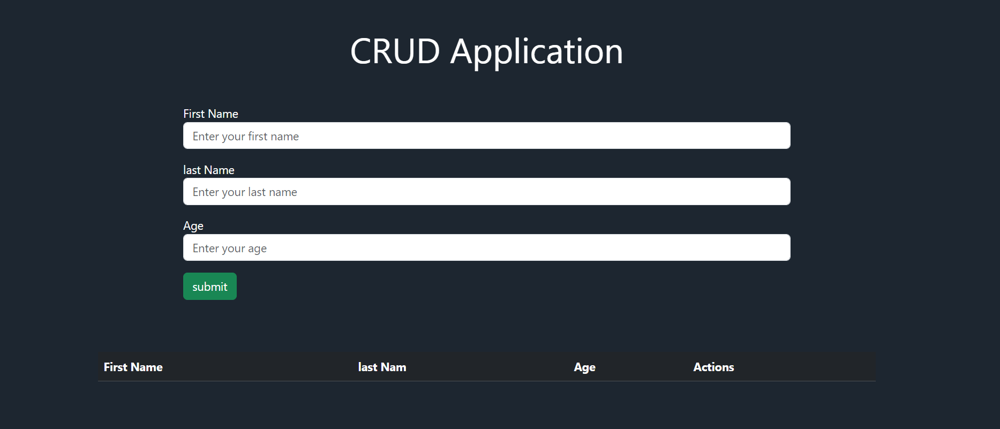
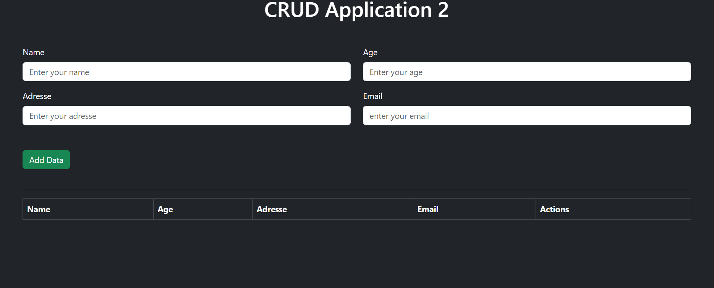
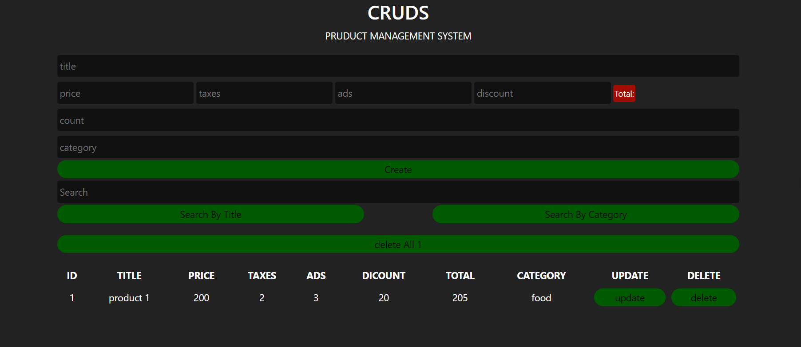
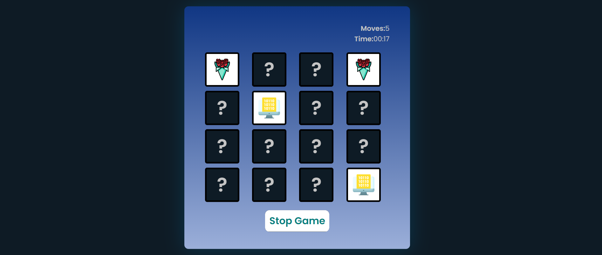
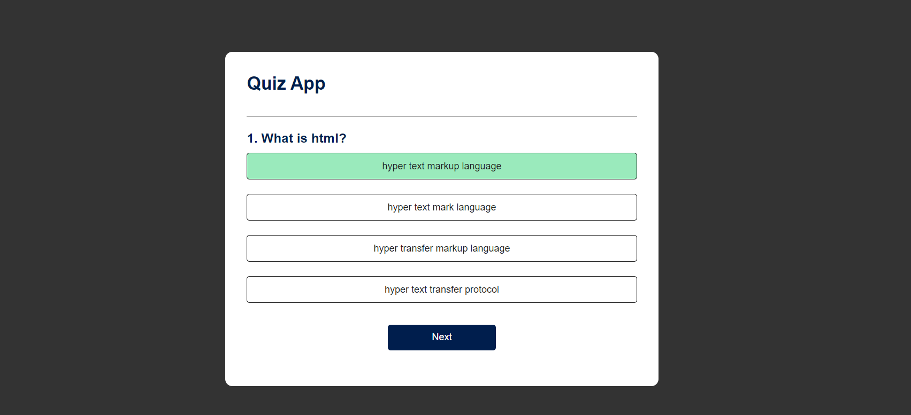
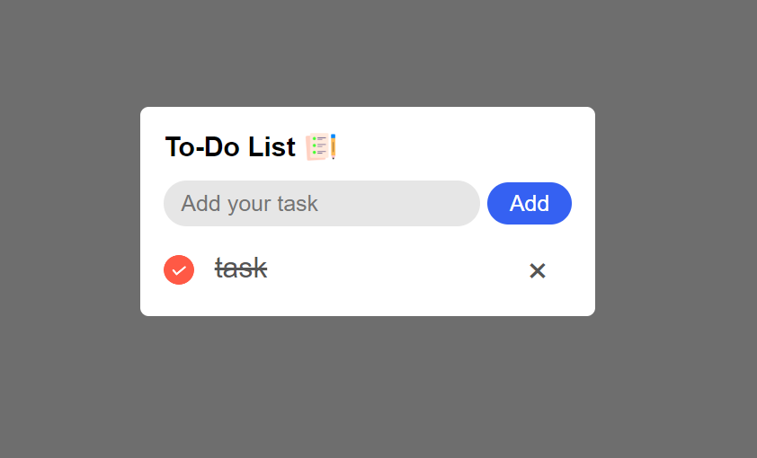

# JavaScript Exercises
Welcome to my JavaScript Exercises repository! This repository contains a series of JavaScript exercises that I've created to enhance my understanding of the language. These exercises cover various topics, including *variables, data types, functions, loops, DOM manipulation*, and more. Whether you're a beginner looking to get started with JavaScript or an experienced developer seeking to brush up on your skills, you'll find valuable exercises here.

